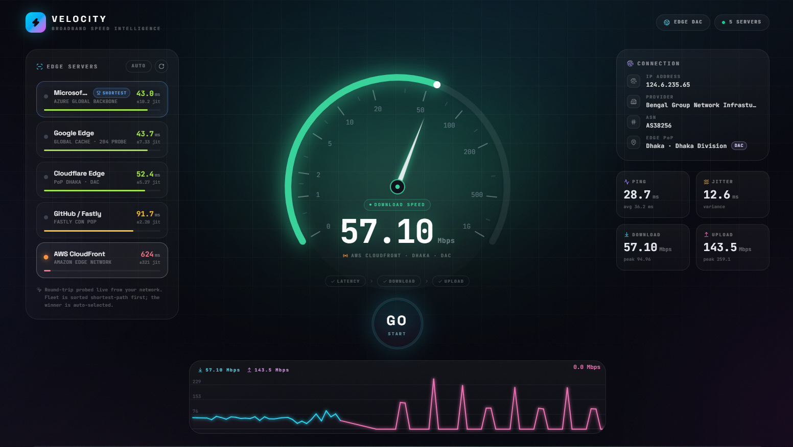

# Velocity ⚡

A precision broadband speed test that races global edge servers, picks the shortest path, and measures real download, upload, ping, and jitter.



## Features

- **Global Edge Routing**: Automatically races 5 different CDN edge networks (Cloudflare, Google, AWS, Azure, Fastly) to find the lowest-latency path.
- **Precision Metrics**: Measures ping, jitter, download, and upload speeds using trimmed-mean aggregations.
- **Sleek, Responsive UI**: A beautiful, modern interface with real-time charts, dynamic gauges, and smooth animations.
- **History Tracking**: Automatically keeps track of your previous speed test results locally.

## Tech Stack

- React 19
- Vite
- Tailwind CSS v4
- Framer Motion
- Lucide React

## Getting Started

1. Clone the repository
2. Install dependencies:
   ```bash
   npm install
   ```
3. Run the development server:
   ```bash
   npm run dev
   ```
4. Or build for production:
   ```bash
   npm run build
   ```

## Developer

Developed with ❤️ by [@nurulanam](https://github.com/nurulanam).
